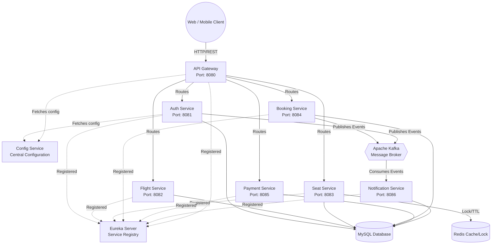

<div align="center">
  <h1>🛫 AirGo System</h1>
  <p><strong>A Modern Microservices-Based Flight Booking Platform</strong></p>
  <p>
    
    
    
    
    
  </p>
</div>

---

## 📖 Project Overview

**AirGo System** is an enterprise-grade, highly scalable online flight booking platform built strictly on a **Microservices Architecture**. Designed to handle concurrent bookings seamlessly, the system leverages an asynchronous, event-driven approach alongside a real-time caching and locking mechanism to ensure data consistency, particularly for high-contention operations like seat reservations.

---

## ✨ Key Features

- 🔐 **Authentication & Authorization**: Secure access using JWT (JSON Web Tokens) and OTP-based email verification.
- ✈️ **Flight Management**: Comprehensive management of flight schedules, routes, and airline data.
- 💺 **Real-Time Seat Locking**: Distributed lock mechanism using Redis to temporarily hold seats (15-minute TTL) during the checkout process, preventing double-booking.
- 🎟️ **Booking & Ticketing**: End-to-end booking lifecycle management.
- 💳 **Payment Integration**: Seamless payment processing integrated with VNPay Sandbox (online payment link generation and callback handling).
- 📧 **Event-Driven Notifications**: Asynchronous email notifications (OTP, booking confirmations) powered by Apache Kafka.
- 🛡️ **Centralized Gateway**: API routing, security checks (JWT Auth Filter), and potential rate-limiting managed by Spring Cloud Gateway.

---

## 🏗️ Architecture

The system is decoupled into highly cohesive, loosely coupled microservices communicating through both synchronous REST APIs (via OpenFeign) and asynchronous message queues (via Kafka).



---

## 🛠️ Tech Stack

### Core Technologies
- **Language**: Java 21
- **Framework**: Spring Boot (v3.2+)
- **Microservices Infrastructure**: 
  - **Spring Cloud Netflix Eureka** (Service Discovery)
  - **Spring Cloud Gateway** (API Routing & Security)
  - **Spring Cloud Config** (Centralized Configuration)
  - **Spring Cloud OpenFeign** (Synchronous Inter-Service Communication)
  
### Data & Messaging
- **Relational Database**: MySQL (Persistent Storage for all services)
- **Caching & Distributed Locks**: Redis
- **Message Broker**: Apache Kafka (with Zookeeper)

### Security & Integrations
- **Security**: Spring Security & JWT (JSON Web Tokens)
- **Payment Gateway**: VNPay Sandbox

### DevOps & CI/CD
- **Containerization**: Docker & Docker Compose
- **CI/CD Pipeline**: GitHub Actions (using Reusable Workflows)

---

## 🚀 Installation & Local Setup

### Prerequisites
- **Java JDK 21**
- **Maven 3.9+**
- **Docker & Docker Desktop** (Must be running)

### Step 1: Start Infrastructure (Databases & Brokers)
Start MySQL, Redis, Zookeeper, and Kafka using Docker Compose:
```bash
docker-compose up -d
```
*(Ensure ports `3306`, `6379`, `2181`, `9092`, and `29092` are available on your machine).*

### Step 2: Start Spring Cloud Core Infrastructure
These services must be started first and in order:
1. **Eureka Server** (Service Registry):
   ```bash
   cd eureka-server
   ./mvnw spring-boot:run
   ```
   *Dashboard available at: `http://localhost:8761`*

2. **Config Service** (Central Configuration):
   ```bash
   cd config-service
   ./mvnw spring-boot:run
   ```
   *Verify at: `http://localhost:8888`*

### Step 3: Start Microservices
Once Eureka and Config Service are fully up and healthy, start the business microservices in any order:
- `api-gateway` (Port: 8080)
- `auth-service` (Port: 8081)
- `flight-service` (Port: 8082)
- `seat-service` (Port: 8083)
- `booking-service` (Port: 8084)
- `payment-service` (Port: 8085)
- `notification-service` (Port: 8086)

---

## 🚢 Deployment & CI/CD

This project implements Continuous Integration and Continuous Deployment (CI/CD) utilizing **GitHub Actions**.
- **Reusable Workflows**: The pipeline leverages a central `build-template.yml` workflow to eliminate redundancy. 
- **Service-Level Triggers**: Each microservice has its own independent `.yml` file in `.github/workflows/`. Builds are triggered dynamically only for the specific microservice where code changes were pushed, dramatically optimizing build time and resource usage.

---

## 📚 API Documentation

Once the services are running, the API endpoints can be accessed via the **API Gateway** (`http://localhost:8080`). 
The project utilizes `springdoc-openapi` for API documentation. You can access the Swagger UI for specific services (if exposed) to interact with and test the RESTful endpoints.

*Example (if exposed via Gateway):*
`http://localhost:8080/swagger-ui.html`

---
*Built with ❤️ for modern software architecture patterns.*
